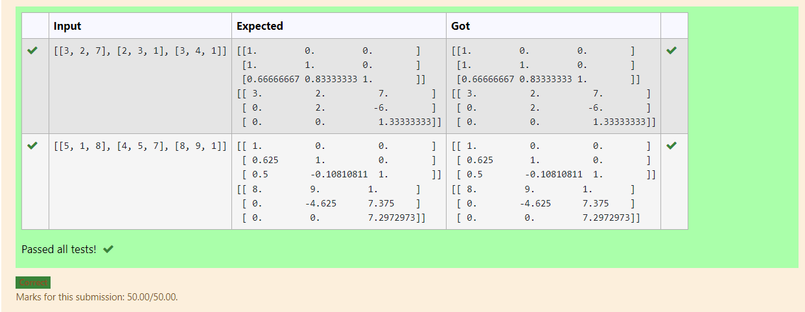
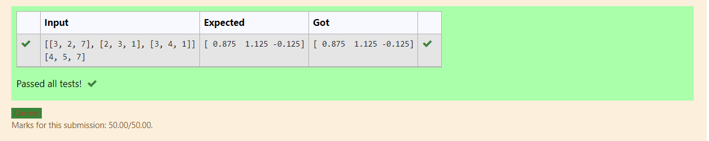

# LU Decomposition 

## i)

## AIM:
To write a program to find the LU Decomposition of a matrix.

## Equipments Required:
1. Hardware – PCs
2. Anaconda – Python 3.7 Installation / Moodle-Code Runner

## Algorithm
1. Import numpy library using import statement
2. From scipy package import lu()
3. Get input from user and pass it as an array
4. Get P,L,U matrix using lu()

## Program:

```
Program to find L and U matrix using LU decomposition.
Developed by: bharath
RegisterNumber: 21500449

# To print L and U matrix
import numpy as np
from scipy.linalg import lu
A=np.array(eval(input()))
P,L,U=lu(A)
print(L)
print(U)

```

## Output:



## Result:
Thus the program to find the LU Decomposition of a matrix is written and verified using python programming.

# 
## ii)

## AIM:
To write a program to find the LU Decomposition of a matrix.

## Equipments Required:
1. Hardware – PCs
2. Anaconda – Python 3.7 Installation / Moodle-Code Runner

## Algorithm
1. import numpy library using import statement
2. from scipy package import lu_factor() and lu_solve()
3. get two inputs from user and pass it as matrix array
4. find solution of the matrix by using lu_solve by passing lu,pivot values as first argument and second matrix as second argument

## Program:

```
Program to solve a matrix using LU decomposition.
Developed by: bharath
RegisterNumber: 21500449

# To print X matrix (solution to the equations)
import numpy as np
from scipy.linalg import lu_factor,lu_solve
A=np.array(eval(input()))
B=np.array(eval(input()))
lu,pivot=lu_factor(A)
x=lu_solve((lu,pivot),B)
print(x)
```

## Output:



## Result:
Thus the program to find the LU Decomposition of a matrix is written and verified using python programming.

